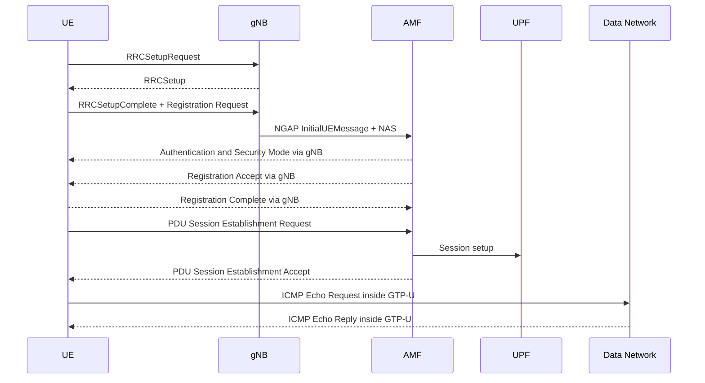

# Lab 1 

**Student:** Chynna  
**Student ID:** M11502273  

## Checkpoint 1: Wireshark Setup - 10 points

### Answer / Evidence

The `OAI-5G` profile is active, `oai-5g-combined.pcapng` is open, and the `nr-rrc` filter displays NR RRC packets. The RAN packets use `127.0.0.1` as the displayed source and destination.

## Checkpoint 2: Basic 5G SA Architecture - 10 points

### Component table

| Component | IP address | Evidence from capture |
|---|---|---|
| UE PDU address | `10.0.0.2` | Inner IP address in GTP-U packet |
| gNB | `192.168.70.129` | NGAP source in InitialUEMessage |
| AMF | `192.168.70.132` | NGAP destination in InitialUEMessage |
| UPF | `192.168.70.134` | Outer GTP-U endpoint in the ICMP screenshot |
| Data Network | `192.168.70.135` | ICMP destination and reply source |

### Interface table

| Interface | Connected components | Main protocol | Purpose |
|---|---|---|---|
| N1 | UE - AMF, logically | NAS-5GS | UE/Core control signaling |
| N2 | gNB - AMF | NGAP | Access and mobility control |
| N3 | gNB - UPF | GTP-U | User-plane packet transport |

### Answer

The control-plane path is gNB `192.168.70.129` to AMF `192.168.70.132` through NGAP. The user-plane path uses GTP-U between gNB `192.168.70.129` and UPF `192.168.70.134`; the UE address is `10.0.0.2` and the Data Network endpoint shown is `192.168.70.135`.

## Checkpoint 3: RRC Connection Establishment - 35 points

### RRC message table

| Message | Direction | Logical channel / SRB | Main purpose | Packet number |
|---|---|---|---|---:|
| `RRCSetupRequest` | UE -> gNB | UL-CCCH / SRB0 | Requests an RRC connection | `104` |
| `RRCSetup` | gNB -> UE | DL-CCCH / SRB0 | Provides initial RRC configuration | `105` |
| `RRCSetupComplete` | UE -> gNB | DCCH / SRB1 | Confirms setup and carries initial NAS | `106` |

### Answers

1. Establishment cause: `TBD` (not visible in the supplied `RRCSetupRequest` screenshot).
2. `RRCSetupRequest` uses SRB0 because the UE has no dedicated signaling bearer yet.
3. `RRCSetup` is sent by the gNB to the UE.
4. Dedicated signaling after setup uses SRB1.
5. `RRCSetupComplete` carries the NAS `Registration Request`.
6. RRC establishment does not mean that the UE is already registered with the 5G Core.

### Evidence

The supplied `nr-rrc` screenshot identifies packet 104 as `RRCSetupRequest` and packet 105 as `RRCSetup`. The following RRC signaling packets carry the NAS procedure.

## Checkpoint 4: RRC-to-NGAP/NAS Mapping - 25 points

### Mapping table

| Stage | Protocol message | Sender -> receiver | Encapsulated information | Packet number |
|---|---|---|---|---:|
| Radio side | `RRCSetupComplete` | UE -> gNB | NAS `Registration Request` | `106` |
| Core side | `NGAP InitialUEMessage` | gNB -> AMF | NAS request in `NAS-PDU` | `110` |
| Registration response | `Registration Accept` | AMF -> UE through gNB | Successful registration | `TBD` |
| Registration completion | `Registration Complete` | UE -> AMF through gNB | Confirms registration | `TBD` |

### Answers

1. The gNB transports NAS between the radio interface and the AMF through NGAP.
2. RRC controls the UE-radio connection; NAS handles mobility and session management with the 5G Core.
3. The message is logically UE-to-AMF, but travels UE -> gNB in RRC and gNB -> AMF in NGAP.
4. `Registration Complete` confirms successful registration after `Registration Accept`.

### Evidence

Packet 110 is shown as `InitialUEMessage, Registration request`, with the NAS-PDU expanded. The NGAP screenshot also shows Authentication Request, Authentication Response, Security Mode Command, and PDU Session Resource Setup signaling. The packet numbers for Registration Accept and Registration Complete are not clearly visible in the supplied screenshots.

## Checkpoint 5: UE IP and User Plane - 15 points

### UE address

| Field | Observed value |
|---|---|
| UE IPv4 address | `10.0.0.2` |
| PDU Session Establishment Accept packet | `TBD` |

### ICMP and GTP-U evidence

| Evidence | Observed value |
|---|---|
| ICMP Echo Request packet | `490` |
| ICMP Echo Reply packet | `495` |
| Number of request/reply pairs | `10` |
| GTP-U tunnel endpoints | `192.168.70.129` / `192.168.70.134` |

### Answers

1. UE IPv4 address: `10.0.0.2`
2. Number of ICMP Echo Request/Reply pairs: 10 pairs are visible in the supplied `gtp || icmp` screenshot.
3. A successful Echo Reply proves that the PDU session was established and user-plane traffic crossed the gNB-UPF GTP-U path.

### Evidence

Packet 490 is a GTP-encapsulated ICMP Echo Request and packet 495 is its GTP-encapsulated Echo Reply. The inner UE address is `10.0.0.2`; the Data Network endpoint is `192.168.70.135`.

## Checkpoint 6: Final UE Connection Sequence - 5 points

### Control-plane and user-plane distinction

- **Control plane:** RRC, NAS, NGAP, Authentication, Security Mode, Registration, and PDU Session signaling.
- **User plane:** ICMP packets transported through GTP-U over N3.

### Evidence

The provided screenshots show the RRC sequence, NGAP/NAS registration sequence, and GTP-U ICMP user-plane exchange required by the final sequence.

## Submission Checklist

- [x] Checkpoint 1 screenshot evidence
- [x] Checkpoint 2 completed IP and architecture tables
- [x] Checkpoint 3 packet numbers and RRC evidence
- [x] Checkpoint 4 RRC/NAS/NGAP mapping evidence
- [x] Checkpoint 5 UE IP and GTP-U/ICMP evidence
- [x] Checkpoint 6 final sequence diagram
